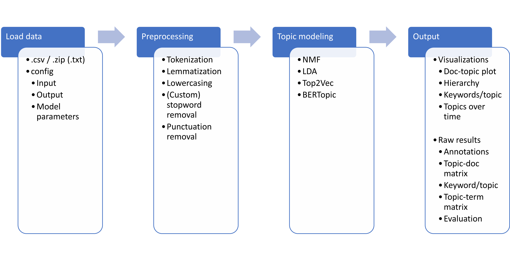

## Documentation

This repository contains code for the topic modeling pipeline for the CLARIAH-VL digital text analysis dashboard and pipeline (DTADP). 

### Installation

1. Create a new conda environment: ```conda create -n {name here} python=3.9.18```
2. Clone the repository: ```git clone https://github.com/LemmensJens/CLARIAH-topic.git```
3. Install the requirements: ```pip3 install -r requirements.txt```
4. Download NLTK's stopwords: ```python -m nltk.downloader stopwords```

### Pipeline overview



### User interface
To run the pipeline in a Gradio User Interface, run ```(CUDA_VISIBLE_DEVICES=X) python app.py``` and browse to ```http://127.0.0.1:7861/```. 
When running the UI on a remote server, connecting to the host with ```ssh``` will allow you to access the interface on your machine through the same url.

### From the command line
#### Set up config file
When using the tool from the command line, specify the following in ```create_config.py```:
- which algorithm to use: BERTopic, Top2Vec, LDA or NMDF
- input format (.csv file or .zip containing .txt)
- in case of .csv: the column name containing the text data and the delimiter
- the directory to the data

Then, specify parameters related to the chosen algorithm:
- Base model (for BERTopic and Top2Vec)
- Number of topics
- ...

And specify which preprocessing steps to apply to your data:
- tokenize text
- lemmatize text
- remove NLTK stopwords
- remove custom stopwords (specify file path to .txt containing one stopword per line)
- remove punctuation
- lowercase text
- use ngrams
- language (relevant for tokenization/lemmatization, and removal of NLTK stopwords)

#### Run the pipeline
Create the config file by running ```python create_config.py``` and start the pipeline with ```python topic_modeling.py```.

#### Output
```evaluation.csv``` contains diversity and coherence scores

```keywords_per_topic.csv``` shows top n most important keywords per topic

```topic_doc_matrix.csv``` matrix showing how much each document relates to each topic

```topic_term_matrix.csv``` matrix containing the weights of all tokens with respect to the topics

```visualizations``` folder containing html visualizations of the topic modeling results

### User Guidelines
#### Algorithm selection
- Top2Vec* (Angelov, 2020): State-of-the-art neural algorithm (default option). Text representations can be based on a pre-trained transformer, or new embeddings can be generated from the input corpus (by setting base model to "Doc2Vec" in the configuration). The latter can be useful if the corpus has a substantial size and when it is expected that the type of language used in the corpus is not represented in the pre-trained language models that Top2Vec features: 'universal-sentence-encoder' (English), 'universal-sentence-encoder-multilingual', 'distiluse-base-multilingual-cased', 'all-MiniLM-L6-v2' (English), and 'paraphrase-multilingual-MiniLM-L12-v2'. Note, however, that training an embedding model with Doc2Vec is substantially slower than using one of the pre-trained models.
- BERTopic* (Grootendorst, 2022):  State-of-the-art neural algorithm that can be used with any pre-trained transformer model that is publicly available on the Huggingface hub. This is useful when you want to use a model that is trained on the same (or similar) data as your corpus. The default model that BERTopic uses is "all-MiniLM-L6-v2" (for English data only). Other models that can be used are, for instance, BERTje/RobBERT (Dutch), CamemBERT (French), German BERT, and multi-lingual BERT (other languages)
- NMF/LDA: Classical machine learning algorithms, which generally perform worse than Top2Vec and BERTopic, but worth investigating when working with a large corpus that contains relatively long texts.

The selection of the embedding model used in Top2Vec or BERTopic should, a.o. depend on the language of your data. If your corpus contains texts written in multiple languages, it is recommended to use a multilingual model. It is also recommended to use a multi-lingual model if the corpus contains texts written in any language other than Dutch, English, French, or German. When no pre-trained mono- or multi-lingual model that was trained on the relevant language (or dialect / historical variant) exists, it is best to either train a new model with Top2Vec using Doc2Vec to generate embeddings, or use a model that was pre-trained on a structurally similar language (e.g. use a Dutch model for Afrikaans).

#### Preprocessing
When using the classical machine learning algorithms (NMF/LDA), it is recommended to apply all preprocessing steps provided in the pipeline (tokenization, lemmatization, lowercasing, and removing stopwords and punctuation). For the neural models, it is not required, since they rely on more sophisticated methods, but experimenting with different preprocessing steps could still result in improvements. Note that when selecting lemmatization, it is important to also apply tokenization. Note that multi-lingual preprocessing is currently not supported.

#### Model parameter tuning and evaluation of the results
Which model and hyperparameters are optimal depends on the data that is used. Therefore, optimization experiments are necessary to find the best configuration. To evaluate the results of the topic modeling algorithm, it is important to investigate both the quantitative results - the diversity and coherence scores - but also the qualitative results by looking at the individual topic predictions, visualizations, and the most important keywords per topic.

#### Automatic evaluation
In order to help the user evaluate the topic model, diversity and coherence scores are computed. The diversity score, i.e. the proportion of unique words, indicates how "diverse" the different topics are from one another. A diversity of score close to 0 indicates redundant topics, whereas a score of 1 indicates high diversity between topics. Coherence, on the other hand, indicates how frequently words within a topic co-occur. The coherence score can range from -14 to +14 (higher is better).

#### References
    Dimo Angelov (2020). Top2Vec: Distributed Representations of Topics. arXiv:2008.09470
    Maarten Grootendorst (2022). BERTopic: Neural topic modeling with a class-based TF-IDF procedure. arXiv:2203.05794
